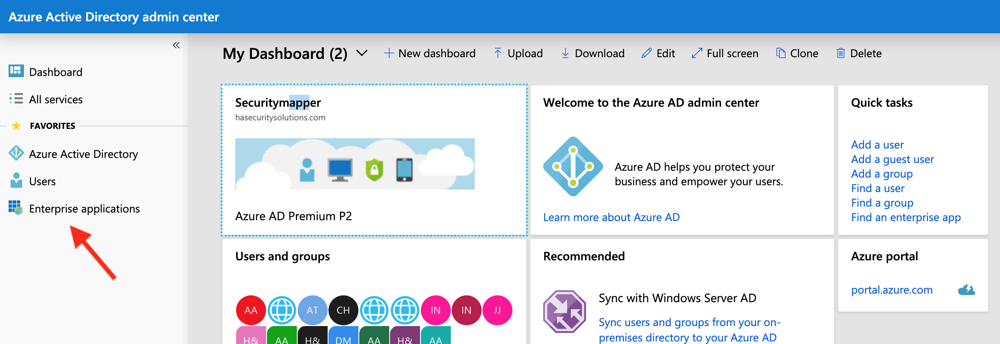
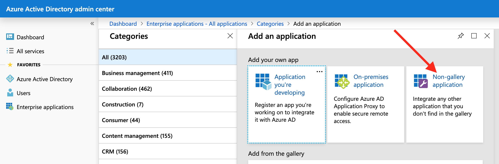

# ReadonlyREST Enterprise + Azure Ad via SAML

[Azure Active Directory (Azure AD)](https://docs.microsoft.com/en-us/azure/active-directory/fundamentals/active-directory-whatis) is Microsoft’s cloud-based identity and access management ([IAM](https://en.wikipedia.org/wiki/Identity_management)) service. And it can be used as a SAML Single Sign-On (SSO) [identity provider (IdP)](https://en.wikipedia.org/wiki/Identity_provider_(SAML)) for a pool of exiting users to sign in and access resources in external service providers like [ReadonlyREST Enterprise](https://readonlyrest.com/enterprise/).

With Azure AD, you can graphically manage users, groups, credentials and permissions. ReadonlyREST Enterprise for Kibana will collaborate with Azure AD to authenticate, grant  permissions and access to tenancies for users that are entirely managed within Azure AD.

In this guide, we are going to see how to configure Elasticsearch and Kibana with ReadonlyREST Enterprise to make use of Azure AD via the SAML protocol. The result will be a multi-user, optionally multi-tenant Kibana instance powered by [ReadonlyREST](https://readonlyrest.com).

## Install Elasticsearch and Kibana
Make sure you have a functioning installation of Kibana, backed by an instance of Elasticsearch. You can find [the installation guide](https://www.elastic.co/guide/en/kibana/current/install.html) in Elastic's website.

## Set up the ReadonlyREST plugins
In order to use ReadonlyREST Enterprise for Kibana, make sure you have installed ReadonlyREST Free for Elasticsearch first. Head to our [setup guide](https://github.com/beshu-tech/readonlyrest-docs/blob/master/elasticsearch.md#installing-the-plugin) to find instructions.

Once ReadonlyREST Free plugin is installed, configure an ACL for accepting SAML sessions from ReadonlyREST Enterprise for Kibana. This is also [explained in our guide](https://github.com/beshu-tech/readonlyrest-docs/blob/master/elasticsearch.md#ror_kbn_auth). Remember to choose a very long secret phrase (256+ characters)

Now head to the Kibana directory, and install a trial (or full) version of ReadonlyREST Enterprise, which can be freely downloaded from [our download page](https://readonlyrest.com/download). For [installation instructions](https://github.com/beshu-tech/readonlyrest-docs/blob/master/kibana.md#installation), see our Kibana plugin guide.

Azure AD only speaks with "https" websites, so make sure your Kibana web server is configured to serve pages in https. See a guide from Elastic on how to enable SSL 
## ReadonlyREST Configuration
Now you should have the `$ES_HOME/config/readonlyrest.yml` file configured to accept SAML sessions from kibana using the `ror_kbn_auth` rule. I.e.

```yml
readonlyrest:
    access_control_rules:
    
    - name: "::KIBANA-SRV::"
      auth_key: kibana:kibana
      
    ... all usual blocks of rules...
        
    - name: "ReadonlyREST Enterprise sessions"
      ror_kbn_auth:
        name: "kbn1"

    ror_kbn:
    - name: kbn1
      signature_key: "my_shared_secret_kibana1_(min 256 chars)" # <- use environmental variables for better security!
```


Now, for our Kibana plugin to speak with Azure AD, your `$KBN_HOME/config/kibana.yml` should look something like:

```yml
xpack.security.enabled: false

elasticsearch.hosts: ["http://localhost:9200"] # <-- consider enabling "https" using the SSL feature in ReadonlyREST Free!
elasticsearch.username: "kibana"
elasticsearch.password: "kibana"
# elasticsearch.ssl.verificationMode: none  # <-- uncomment if your Elasticsearch uses "https" with self signed certificates

server.ssl.enabled: true
server.ssl.certificate: '/etc/kibana/ssl_cert/localhost.pem'
server.ssl.key: '/etc/kibana/ssl_cert/localhost-key.pem'

readonlyrest_kbn:

  logLevel: debug
  clearSessionOnEvents: ["login"]

  auth:
    signature_key: "my_shared_secret_kibana1_(min 256 chars)" # <- use environmental variables for better security!

    saml_azure:
      buttonName: 'Azure AD SAML SSO'
      enabled: true
      type: saml
      issuer: 'ror'
      protocol: 'https'
      entryPoint: 'https://login.microsoftonline.com/xxxxxxxx-xxxx-xxxx-xxxx-xxxxxxxxxxxx/saml2'
      kibanaExternalHost: 'localhost:5601'
      usernameParameter: 'http://schemas.microsoft.com/identity/claims/displayname'
      groupsParameter: 'http://schemas.microsoft.com/ws/2008/06/identity/claims/groups'

```

## Azure AD configuration
1. Login in your Microsoft Azure dashboard, and head to Enterprise Applications.


2. Click on "Non-gallery application".


3. Create a new app called "Readonlyrest Enterprise".


4. Click "Single Sign On" to configure the app for SAML.


5. Insert URLs and data about our Kibana server as shown in the picture. And press SAVE.


6 Make sure this app has at least a test user assigned, and press SAVE. Otherwise the single sign-on will fail.


## Testing if this all works.
1. Now point your browser to your Kibana installation (in the example https://localhost:5601).
You should now see a new blue button that says "Azure AD SAML SSO". 


2. Press it, and you should see the Azure AD login page. Place your credentials here, or pick an already authenticated identity to enter Kibana.

3. 

4. You will now be redirected to Kibana, logged in as your Azure AD identity.


5. You can now logout from the "ReadonlyREST SAML SSO" Azure AD Enterprise app by pressing the exit button right beside the username in the bottom right corner.


