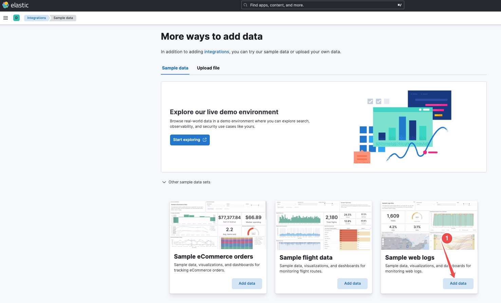
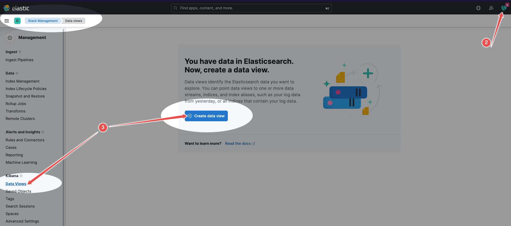
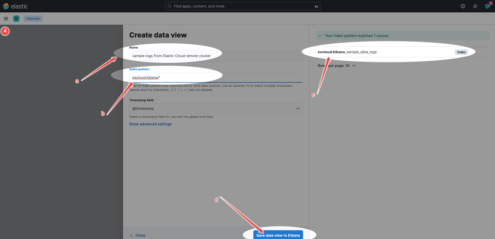
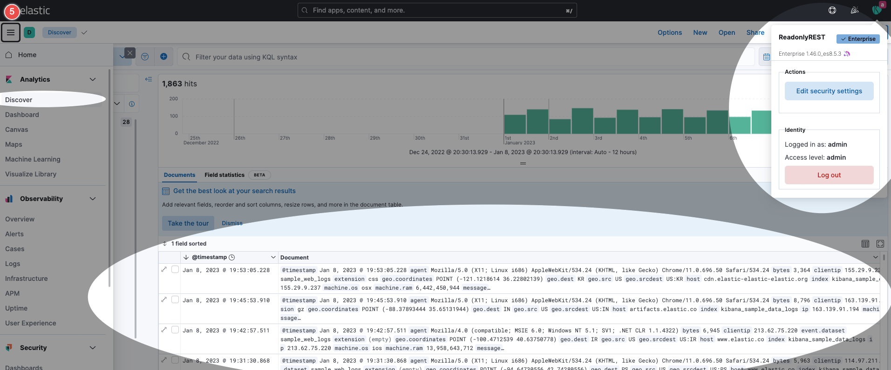

# INTEGRATION
# ROR-based cluster with remote X-Pack Security cluster on Elastic Cloud

ReadonlyREST plugin cannot be installed on Elastic Cloud. But we can still take advantage of ROR's features with a little, 
smart trick - [the remote cluster](https://www.elastic.co/guide/en/elasticsearch/reference/current/remote-clusters.html) Elasticsearch feature. A self-managed ROR-based cluster can access an Elastic Cloud cluster when the latter is configured
as a remote cluster in the first one. 

## Solution Architecture 

[todo: FIGURE]

Both clusters will communicate at a transport level. The communication is secured by two-way SSL. Because both clusters have to be
configured to trust each other, the bootstrapping procedure is not straightforward. But we prepared a demo that provides 
an interactive guide to properly set up the clusters. Moreover, details of the setup are described below. Let's start!

## Configuration

Depending on what you need now, you may be interested in either:

* [Quick Start using our docker-based Playgound](playgroud.md) 
* [Detailed explanation on how to set up the solution](details.md)

## Testing

You can test the setup using Kibana sample web logs. 
Here are the steps to do:

1. Open your browser and go to your Elastic Cloud deployment Kibana and add "Sample web logs".

    

        
Expand it to know how to find it in the Elastic Cloud Kibna

    

    

2. In the new browser's tab, open Local ROR cluster Kibana (`http://localhost:15601/`) and log in as admin (`admin:admin`).

3. Pick `Stack Management` in the Kibana menu, go to `Data views`, and click `Create data view` to create the data view to explore the sample logs from the Elastic cloud cluster.

    

4. Fill out the form to create a data view:

    a) pick `Name` (it doesn't matter what you enter here)
    b) enter index pattern `escloud:kibana*` 
    c) one index should be matched: `escloud:kibana_sample_logs` 
    d) click `Save data view to Kibana`

    

5. Pick `Discover` in the Kibana menu. You should see the data. It's great, but currently, you are logged as `admin` who has access to all indices. Let's try with a different user. Click `Log out`.

    

6. Let's log in as `user1` (`user1:test`). This user has RO access and should be able to see `escloud:kibana_sample*` indices (check `readonlyrest.yml` or ROR's settings editor while being logged as `admin`). Go to `Discover` in the Kibana menu and check if you see all the logs from the Elastic Cloud cluster.

    

7. As you saw, the cross-cluster search and Kibana integration works well :) This is the basic setup and the simple use case. Now, you can play with it and try to do something more complicated. 
