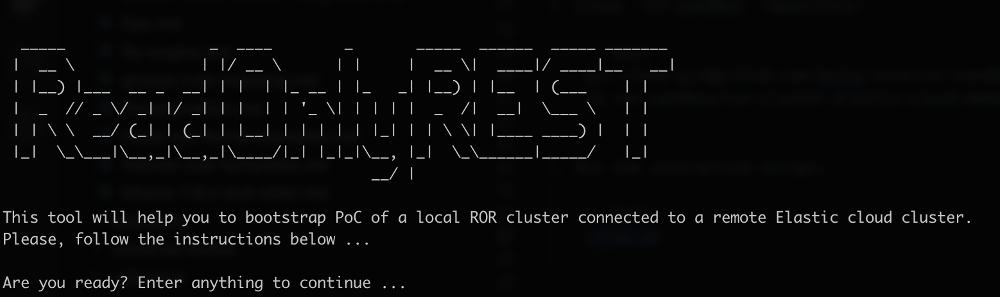
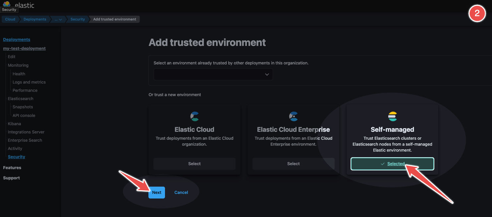

## Docker-based local ROR cluster and remote Elastic Cloud cluster PLAYGROUND

This document is a step-by-step guide on how to bootstrap a playground with a local ROR cluster in docker (one Elasticsearch node and one Kibana node) 
and connecting it to a real Elastic Cloud deployment using the "Trusted deployment" feature in Elastic Cloud.

This guide requires minimal knowledge because most of the process is automated. This interactive script will help you to do it quickly. As a result of the script, you will have a working local ROR cluster connected to the remote Elastic Cloud cluster. 

#### Before you start
1. Linux or Mac OS machine (Windows is untested)
2. Account in https://cloud.elastic.co/ and valid deployment (a free trial is OK)
2. [Docker](https://www.docker.com/) and [docker-compose](https://docs.docker.com/compose/) and [Git](https://git-scm.com/) installed

#### Running interactive script
1. Clone `ror-sandbox` repository:

    ```bash
    git clone git@github.com:beshu-tech/ror-sandbox.git
    cd ror-sandbox/ror-cluster-elastic-cloud-demo/
    ```

2. Run the interactive script:

    ```bash
    ./run.sh
    ```

    

3. After hitting enter, you will be asked to download the [CA file](https://en.wikipedia.org/wiki/Certificate_authority) with trusted Elastic Cloud deployment certificates:

    

    <details>
        <summary>Expand it to know how to find it in the Elastic Cloud console</summary>

    

    

    

    </details>

4. Let's assume the CA file was downloaded and saved in `/tmp` folder. Let's enter the location of the file and hit enter:

    

    The interactive script will use the CA file and generate certificates of the local cluster and its CA too. Let's hit enter to continue ...

    

    As we can see CA file `ca.crt` of the ROR cluster was created in `/tmp/ror-sandbox/ror-cluster-elastic-cloud-demi/certs/ca` folder. 

5. Now, the ROR cluster CA file will be used to add a trusted deployment in Elastic Cloud:

    

    <details>
        <summary>Expand it to know how to find it in the Elastic Cloud console</summary>

    

    

    

    

    </details>

6. The next step is to configure the Elastic Cloud remote cluster settings. Our script will ask you to provide "Proxy address" and "Server Name". Both can be found in the Elastic Cloud console.
   
    


    <details>
        <summary>Expand it to know how to find it in the Elastic Cloud console</summary>

    

    </details>

7. This is all we need to do in the Elastic Cloud console. Now, we can pick Elasticsearch, Kibana and ROR versions:

    

8. Now, the script will create the docker-compose environment with one node of Elasticsearch with ROR installed and connected to the remote Elastic Cloud cluster. Moreover, one node of Kibana with ROR too will be visible `http://localhost:15601`. It's time to test it now :)

    
