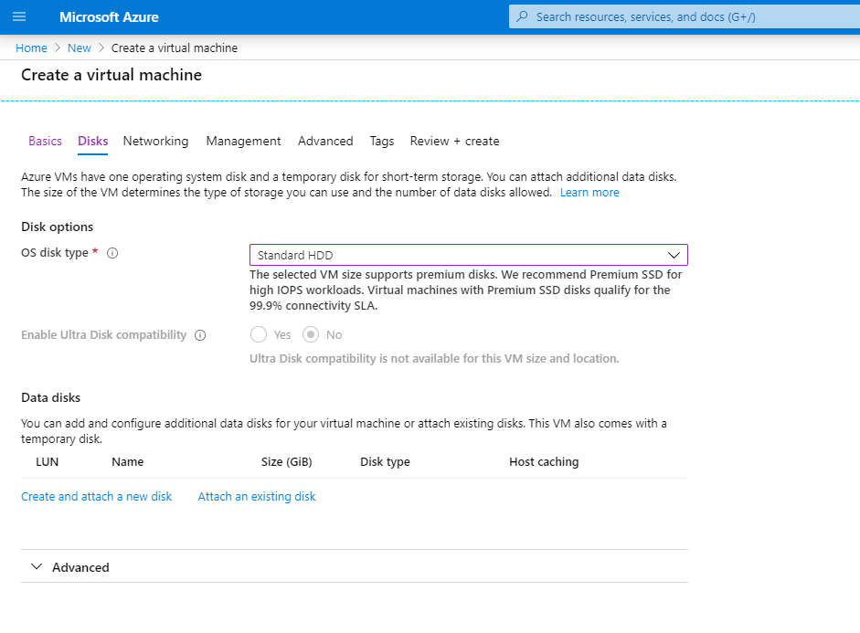
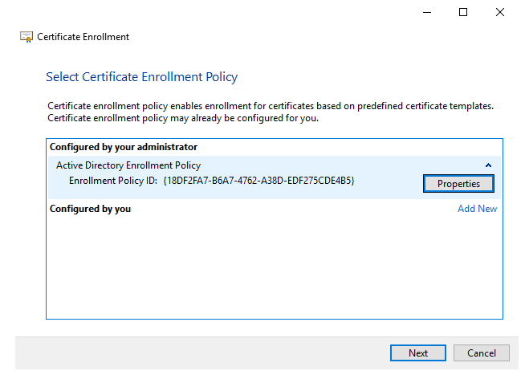
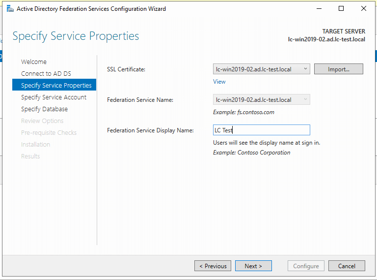
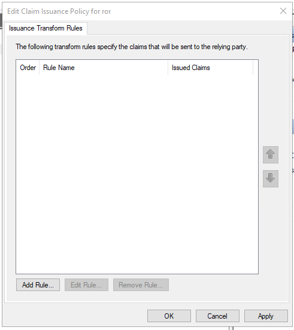

# Microsoft ADFS

How to Connect ROR Enterprise with SAML and ADFS

ReadonlyREST (ROR) Enterprise allows for complex authentication and authorization configurations with Kibana and Elasticsearch. When Elasticsearch is combined with Kibana, a data visualization dashboard, the combination provides a powerful way to ingest logs and analyze data.

To access that data, many enterprises manage users in a central directory. This directory could be an Active Directory (AD) instance, in the case of a Windows-centric environment, or a cloud directory provider, such as Google Cloud Identity, in a cloud-based environment. Instead of integrating these services directly into a product, an abstraction layer such as SAML can provide authentication and authorization and tie into different back ends as necessary.

ReadonlyREST provides a free Elasticsearch plugin that provides advanced authentication options. When it is combined with the ReadonlyREST Enterprise plugin for Kibana, integrating SAML authentication into the authentication process becomes easy.

This article will walk through the process of setting up an entire environment in order to demonstrate how the ReadonlyREST free and Enterprise plugins integrate with Active Directory Federation Services (AD FS) to provide SAML authentication.

In this tutorial, you will learn how to:

* Provision Azure Virtual Machines to host Active Directory, Elasticsearch, and Kibana
* Install and configure Active Directory (AD) Services
* Provision sample AD users
* Install and configure Active Directory Certificate Services (AD CS)
* Install and configure Active Directory Federation Services (AD FS)
* Install and configure ElasticSearch and the ReadonlyREST Free Plugin
* Install and configure Kibana and the ReadonlyREST Enterprise Plugin

## Provisioning Azure Virtual Machines to Host Active Directory, Elasticsearch, and Kibana

Any Windows Server 2016 Virtual Machines (VM) can be used for this process; however, in this demonstration, the Microsoft Azure environment will be used to provision and host the VMs.

You can name your VMs whatever you would like. This article will refer to the names listed below for consistency.

* Virtual Machine 1: lc-win2019-02
  * **Roles**: Active Directory, AD Certificate Services, AD Federation Services, DNS
  * **Memory**: 4GB
* Virtual Machine 2: lc-win2019-03
  * **Roles**: Elasticsearch, Kibana
  * **Memory**: 8GB

These Azure VMs will be Pay-As-You-Go and Spot Instances for affordability. The example shown below is for the Elasticsearch and Kibana VM which will be duplicated for the Active Directory VM but will have 4GBs of memory instead of 8GB.

_Please note that Azure Spot Instances cannot be resized after creation._

### Provisioning Virtual Machines

1. Log into the **Azure portal** using a **Pay-As-You-Go** subscription.
2. Create a **new virtual machine.**
3. If you do not already have a **resource group** created to serve as a home for the VMs, select **Create new** and create the **resource group.**
4. Name your virtual machine appropriately, and choose the details for your instance, as shown in the example below.
5. You can use the default hard drive sizes and **Standard HDD** disks for this environment.
6. 
7. The default **Networking** options will also work here.
8. 
9. As will the default **Management** options.
10. 
11. No additional **Advanced** options are necessary.
12. 
13. If you would like to tag your VMs for later categorization and tracking, you can do so here.
14. 
15. Finally, create the VM.

After this VM has been created, create one more to host the Active Directory and related services. In the end, you should have two VMs as outlined above.

## Installing and Configuring Active Directory (AD) Services

After the two VMs have been provisioned, the next step is to set up directory services on the first VM, lc-win2019-02.

### Installing Active Directory Services

1. Once you are logged into lc-win2019-02, choose **Add Roles and Features** on the **Server Manager** screen.
2. Select **Role-based or feature-based installation**.
3. 
4. Select the correct server from the server pool.
5. 
6. Select **Active Directory Domain Services,** and add the additional features as prompted.
7. No additional features are necessary since the default options work.
8. 
9. Click **Next** on the **Active Directory Domain Services** informational screen.
10. 
11. Finally, select **Restart the destination server automatically if required**. Click **Yes** when prompted, and then click **Install.**
12. Once installation has finished, click on **Close.**
13. 

### Configuring Active Directory Services

If DNS has not been installed already, the role installation screen may pop up in the middle of the Active Directory installation. Installation instructions for the DNS role are shown after the Configuring Active Directory Services section below.

1. Click on **Promote this server to a domain controller,** which will allow you to see the **Deployment Configuration** screen.
2. 
3. Name the domain. In this case, use ad.lc-test.local.
4. This name was arbitrarily chosen. Using a subdomain such as “ad” instead of your actual domain (i.e., \[lc-test.local]\([http://lc-test.local\\](http://lc-test.local/\)\)%20by%20itself/) is recommended.
5. 
6. Select **Windows Server 2016** as the **functional level**. For the **domain controller capabilities**, choose **Domain Name System (DNS) server**. Set a Directory Services Restore Mode (DSRM) **password.**
7. 
8. The following **DNS Options** warning message can be disregarded:
9. 
10. Set the **NetBIOS domain name**, which is usually the short name prior to the host name (e.g., AD), and click **Next.**
11. 
12. Use the default paths, and click on **Next.**
13. 
14. On the **Review Options** screen, click **Next** if everything looks correct.
15. 
16. On the **Prerequisites Check** screen, click **Install.**
17. You’ll see a number of warnings related to the fact that this is a test environment. They can be safely ignored.
18. 
19. When you click **Close**, you will have a successful configuration.
20. 
21. Click **Close** on the restart prompt.
22. 

### Configuring the Domain Name Services (DNS) Role

1. Click on the **DNS Services** role, add the additional features as requested, and click **Next.**
2. If you are using DHCP for the server (this is not recommended for a production service), then you will see the validation warning shown below. It can be disregarded. Click on **Continue** and **Install.**
3. 
4. Click **Next** on the **Features** screen, since no additional features are necessary.
5. 
6. Click **Next** on the informational **DNS Server** screen.
7. 
8. Click **Install** on the **Confirmation** screen.
9. 
10. Select **Restart the destination server automatically if required,** and click **Install.** Finally, click **Close,** and you will have a successful installation.
11. 

### Joining Computers to the Domain

Next we need to join the second server—the one hosting Elasticsearch and Kibana—to the domain.

1. Open an RDP connection to the second server. Then, open **Notepad** as an Administrator, and open the file C:\Windows\System32\drivers\etc\hosts.
2. 
3. Add the IP address and hostnames for the domain controller.
4. These will reflect the IP addresses and hostnames you chose for your configuration:
   * **FQDN**: 10.0.0.5 - ad.lc-test.local
   * **NetBIOS**: 10.0.0.5 - ad
5. 
6. Additionally, you will need to change your network adapter DNS to point to your domain server; in this case, it is 10.0.0.5.
7. If the system restarted, open an RDP connection, and then open the **System** screen under the **Control Pane** and select **Advanced System** settings.
8. 
9. Click on **Change** to add this server to the domain.
10. 
11. Enter the domain (e.g., ad.lc-test.local).
12. 
13. Click on **OK,** and enter the credentials of the account that has privileges enabling it to add the domain.
14. 
15. Restart the server after joining it to the domain.

## Provisioning Sample AD Users

For testing purposes, it can be useful to provision additional users within the Active Directory. The following PowerShell script, which should be run on the domain controller, will make this easy. Note that we are setting the mail attribute which will be used for the SAML username.

Import-Module -Name 'ActiveDirectory'

$Domain = 'ad.lc-test.local'\
$OU = 'CN=Users,DC=ad,DC=lc-test,DC=local'

$Users = @{\
"TestUser1" = "testPass1"\
"TestUser2" = "testPass2"\
"TestUser3" = "testPass3"\
"TestUser4" = "testPass4"\
"TestUser5" = "testPass5"\
}

$Users.GetEnumerator() | ForEach-Object {\
$Name = $\_.Key\
$Password = $\_.Value

$Params = @{\
"Name" = $Name\
"Path" = $OU\
"AccountPassword" = (ConvertTo-SecureString -AsPlainText $Password -Force)\
"Enabled" = $True\
"DisplayName" = $Name\
"PasswordNeverExpires" = $True\
"CannotChangePassword" = $True\
"EmailAddres" = "$Name@$Domain"\
}

New-ADUser @Params\
}

## Installing Active Directory Certificate Services (AD CS)

1. Click on **Active Directory Certificate Services,** and add the additional features as prompted.
2. Since no additional features are necessary, allow defaults, and click on **Next.**
3. 
4. On the **Active Directory Certificate Services** informational screen, click **Next** to continue.
5. 
6. Select the **Certification Authority** role services, and click **Next.**
7. 
8. Select **Restart the destination server automatically if required,** and click on **Install.**
9. 
10. Finally, click on **Close** when the installation has been completed.
11. 

### Configuring Active Directory Certificate Services

1. Click on **Configure Active Directory Certificate Services.**
2. 
3. Select the default administrative user for AD CS credentials.
4. 
5. Under **Role Services**, check **Certification Authority,** and click Next.
6. 
7. Select **Enterprise CA,** and click on **Next.**
8. 
9. Click on **Root CA**, then click on **Next.**
10. 
11. Click on **Create a new private key,** and then click on **Next.**
12. 
13. Select **RSA#Microsoft Software Key Storage Provider**, a default key length of **2048**, and a hash algorithm of **SHA256.** Click **Next.**
14. 
15. Use the defaults given for the CA Name, and click on **Next.**
16. 
17. Select a validity period of 5 years, and click on **Next.**
18. 
19. Leave the default database locations in place, and click on **Next.**
20. 
21. Click on **Configure** and **Close** when the configuration process has been completed.
22. 

## Installing and Configuring Active Directory Federation Services (AD FS)

Previously, it was recommended that AD FS should not be installed on the same server as the DC because IIS was installed as part of that process. As of 2012, this recommendation has changed, since AD FS does not use IIS anymore. Now, mounting AD FS and DC on the same server is advised for domains under 1000 users.

### Provisioning SSL Certificate Templates

1. Open the **Certification Authority** MMC snapin, right-click on **Certificate Templates,** and click on **Manage.**
2. 
3. Select **Duplicate Template** on the **Web Server** template.
4. 
5. Enter “SSL Certificates” in the box labeled **Template display name** on the **General** tab.
6. 
7. On the **Security** tab, click on **Enroll** and **Allow for Authenticated Users,** and, finally, **Apply** the configuration.
8. 
9. Right-click on **Certificate Templates → New → Certificate Template to Issue.**
10. 
11. Select **SSL Certificates** from the **Certificate Template** list, and click **OK.**

### Provisioning the SSL Certificate

1. Open the Certificates MMC snapin for the Local Computer. Navigate to **Personal → Certificates,** and right-click to open **All Tasks → Request New Certificate.**
2. 
3. Click **Next** on the **Before you Begin** screen.
4. 
5. Click **Next** on the **Select Certificate Enrollment Policy** screen.
6. 
7. Select **SSL Certificates,** and click on **More information is required to enroll for this certificate.** Select **Click here to configure settings** to configure the certificate.
8. 
9. Add the following details on the **Certificate Properties Subject** screen, then click **OK**:
   * **Subject Name**
     * **Common Name**: CN=lc-win2019-02.ad.lc-test.local
   * **Alternative Name**
     * **DNS**: lc-win2019-02.ad.lc-test.local
     * **DNS**: enterpriseregistration.ad.lc-test.local
10. 
11. Click on **Enroll** to request the certificate, then click **Finish**.
12. 

### Setting up Active Directory Federation Services

1. Select the **Active Directory Federation Services** role, and click **Next.**
2. 
3. Click **Next** on **Select Features**, since no additional features are needed.
4. 
5. Click **Next** on the **Active Directory Federation Services** informational screen.
6. 
7. Check **Restart the destination server automatically if required,** and click **Install** and **Close** when the installation has completed.
8. 

### Creating a Group Managed Service Account and Adding a KDS Key

It is best to use a **gMSA** (group Managed Service Account) instead of a traditional **sMSA** (standalone Managed Service Account). The primary difference between the two is that, in a gMSA, the Windows operating system manages the password for the account instead of relying on the administrator to do it.

Before we can select the gMSA, however, we need to add a **KDS Root Key**. To avoid non-blocking warnings later in the process, this key should be added with an effective date of 10 hours prior to the current date and time.

Open a **PowerShell** session as an Administrator, and run the following command to add the KDS root key:

Add-KdsRootKey -EffectiveTime ((Get-Date).AddHours(-10))

If you do not take this step, you will see the following error when attempting to add the gMSA account:


To create a gMSA account to use with the AD FS service, use the PowerShell script provided below. If you get an “access denied” error when running Install-ADServiceAccount, you may need to restart the server first.

$Name = 'sa\_adfs'

$Params = @{\
"Name" = $Name\
"DNSHostName" = 'lc-win2019-02.ad.lc-test.local'\
"PrincipalsAllowedToRetrieveManagedPassword" = 'lc-win2019-02$'\
"ServicePrincipalNames" = 'http/lc-win2019-02.ad.lc-test.local'\
}

$ServiceAccount = New-ADServiceAccount @Params

Install-ADServiceAccount -Identity $Name

Add-ADComputerServiceAccount -Identity 'lc-win2019-02' -ServiceAccount $ServiceAccount

### Configuring Federation Services

1. Click on the link that says **Configure the federation service on this server**.
2. 
3. Select **Create the first federation server in a federation server farm,** and click **Next.**
4. 
5. On the **Connect to Active Directory Domain Services** screen, leave the default user selected, then click on **Next**.
6. 
7. Select the previously created SSL Certificate, and enter “LC Test” for the **Federation Service Display Name.** Click **Next.**
8. 
9. On the **Specify Service Account** screen, click on **Select** to use an existing account and locate the sa\_adfs service account that was previously created. Click **Next.**
10. 
11. Select **Create a database on this server using Windows Internal Database,** and click **Next**.
12. 
13. Click on **Next** under **Review Options.**
14. 
15. Verify the **Pre-requisite Checks,** and click on **Configure.**
16. 
17. Click on **Close,** and restart the server.
18. The warnings shown below can be disregarded for this test instance:
19. 
20. Once the server has restarted, open an Administrative PowerShell session, and run the following command to enable the **IdP Signon Page:**
21. Set-ADFSProperties -EnableIdPInitiatedSignonPage $True
22. Verify that AD FS metadata is being returned by navigating to the following URL:
23. [https://{FQDN](https://{fqdn) of AD FS Server}/adfs/fs/federationserverservice.asmx
24. 

### Setting Up ReadonlyREST Relying Trust

1. Open the **AD FS** MMC snapin, right-click on the **Relying Party Trusts** folder, and select **Add Relying Party Trust.**
2. 
3. Select **Claims aware,** and click **Start.**
4. Choose **Enter data about the relying party manually,** and click **Next.**
5. Enter a **Display Name** (in this case, “ror”), and click **Next.**
6. It’s not necessary to specify a token encryption certificate, so click **Next** to continue.
7. Select the option **Enable support for the SAML 2.0 SSL service URL,** and enter:
8. [https://{IP Address of Kibana Server}:5601/ror_kbn_sso_saml_adfs/assert](https://10.0.0.6:5601/ror_kbn_sso_saml_adfs/assert)
9. The saml\_adfs will change depending on the name chosen in the configuration of the kibana.yml file.
10. Enter the **Relying party trust identifiers**, in this case, “ror.” This will match the **Issuer** in the Kibana configuration. Click **Next** when you are done with this step.
11. On the **Access Control Policy** screen, select **Permit everyone,** and click **Next.**
12. Click **Next** to finish adding the trust.
13. Verify that **Configure claims insurance policy for this application** is selected, and click on **Close.**

### Configuring Claims

Though we have not yet configured claims for Kibana, the metadata for the SAML configuration in Kibana would look similar to the following, if you were able to view it:


The important section to note concerns the claims issuance policy. We need to return a **NameID** format in the form of an **emailAddress** by entering the following code\*\*:\*\*

\<NameIDFormat>\
urn:oasis:names:tc:SAML:1.1:nameid-format:emailAddress\
\</NameIDFormat>

Therefore, we need two rules: one to pull back the LDAP attribute from the Active Directory, and another to transform that data into the correct format.

1. Click on **Add Rule** on the **Edit Claim Issuance Policy** **for ror** screen.
2. 
3. For the first rule, choose **Send LDAP Attributes as Claims,** and click **Next.**


1. Choose the AD Attribute to return—in this case, the email address—and click **Finish** on the **Configure Rule** screen of the **Add Transform Claim Rule Wizard.**
   * **Claim rule name**: LDAP Email
   * **Active Store**: Active Directory
   * **LDAP Attribute**: E-Mail-Addresses
   * **Outgoing Claim Type**: E-Mail Address


1. Click on **Add Rule,** then choose the **Transform an Incoming Claim** claim rule template, and click on **Next.**


1. Enter the transformation details as listed below, and, on the **Edit Rule** screen, click on **OK.**
   * **Claim rule name**: Email Transform
   * **Incoming claim type**: E-Mail Address
   * **Outgoing claim type**: Name ID
   * **Outgoing name ID format**: Email
   * **Pass through all claim values**: Selected


1. Click **OK** to save the rules.
2. Please note that the order of the rules on the **Edit Claim Issuance Policy** screen is important.
3. 

### Updating Relying Party Trusts

1. Navigate to the **Relying Party Trusts** folder, right-click on the **ror trust,** and select **Properties.**


1. Click on the **Endpoints** tab, select the **SAML Assertion Consumer Endpoints,** and click on **Edit.**


1. Click on **Set the trusted URL as default,** and change the Index to 1 from 0. Click **OK.**


1. On the **Endpoints** screen, click on **Add SAML,** and enter the **SAML Logout** details as follows:
   * **Endpoint Type**: SAML Logout
   * **Binding**: POST
   * **Trusted URL**: [https://{IP](https://{ip) Address of Kibana Server}:5601/ror_kbn_sso_saml_adfs/notifylogout


1. Click on **OK** to save the modified properties. 

## Installing and Configuring Elasticsearch and the ReadonlyREST Free Plugin

### Installing Elasticsearch

Elasticsearch will be installed on the lc-win2019-03 server provisioned with 8GB of RAM in Azure.

1. Locate a recent download of [Elasticsearch](https://www.elastic.co/guide/en/elasticsearch/reference/7.6/windows.html), and install the [MSI](https://artifacts.elastic.co/downloads/elasticsearch/elasticsearch-7.6.2.msi) package.
2. At the time this article was written, the most recent version available was 7.6.2; however, you may want to check for more updated versions as they become available.
3. Launch the downloaded installer and click **Next** on the **Locations** screen, leaving the defaults in place.
4. 
5. Use the defaults on the **Service** screen, and click **Next.**
6. 
7. Use the defaults on the **Configuration** screen, and click **Next.**
8. 
9. No additional plugins are necessary; therefore, click **Next.**
10. 
11. Leave the **X-Pack** licenses set to **Basic,** and click on **Install.**
12. 
13. Click on **Exit.**
14. 

### Installing the Elasticsearch Plugin

1. Navigate to the [ReadonlyREST Plugin download page](https://readonlyrest.com/download/) to enter your details. You will receive the download link in your email. Make sure to choose the **Free Elasticsearch Plugin** that matches your Elasticstack version.
2. 
3. Download the plugin, open an Administrative command prompt, and navigate to the Elasticsearch program directory. Run the plugin installation by entering the following:
4.  cd "C:\Program Files\Elastic\ElasticSearch\7.6.2\bin"

    elasticsearch-plugin.bat install file:///C:/Users/lc-admin.AD/Downloads/readonlyrest-1.19.4\_es7.6.2.zip
5. 
6. Navigate to the C:\ProgramData\Elastic\ElasticSearch\config directory, and create the file readonlyrest.yml.
7. 
8. Open the readonlyrest.yml file in Notepad to run this very basic configuration that configures the following two different access control rules: 1. **“**::KIBANA-SRV::**”**—this rule allows the Kibana server to authenticate to Elasticsearch using digest authentication with the username “kibana” and password “kibana.” 2. “ADFS Users”—this rule uses the ror_kbn_auth method which allows SAML authenticates to succeed.
9. Create a random 256-character signature\_key. This key will be shared between Kibana and Elasticsearch.
10. Please note that the kbn1 identifier must match in the ror_kbn_auth and ror_kbn sections; however, any names can be used for them.

    ```yaml
    readonlyrest:  
     access_control_rules:

     - name: "::KIBANA-SRV::"  
       auth_key: kibana:kibana

     - name: "ADFS Users"  
       ror_kbn_auth:  
         name: "kbn1"

     ror_kbn:  
     - name: kbn1  
       signature_key: "VEGj@YLLhsAigspnNi2Xsopsqja_nrKUqU__eQW9VQ2!9p!RoeHwc-G.y-MVJtYYcDFCH.e3W2BKcZsoynJaHyjjXyh7kDHjsYKPkczvai-xCzP@Ez3QW23ZBFuReA7kPAqnc6pQ3VeNeFf3sWNoKeJAt_d9J7aFwEvCP2Gb-kQcA8YR*wNWHQuo-jwmmo2Qqpu_Fq3aKFCbNFWUbK@BVwmmKezxn3h687mAkuyhV4.hnfrjVjF-Rphjqmy4.tB8"
    ```
11. Restart **Elasticsearch** **Windows Service**. This can be done in the **Services** MMC snapin.

## Installing and Configuring Kibana and the ReadonlyREST Enterprise Plugin

### Installing Kibana

1. Locate a recent download of [Kibana](https://artifacts.elastic.co/downloads/kibana/kibana-7.6.2-windows-x86\_64.zip), and download the zip package. At the time this article was written, the most recent version was 7.6.2. You may want to check for more updated links as they become available.
2. Extract the Kibana installation. Note that this is a rather large file. If you have trouble with the default Windows zip extractor, you may want to try a tool such as 7-Zip.
3. 
4. Move the extracted folder to C:\kibana. This may require you to rename the folder.
5. 
6. Open an administrative command prompt, and navigate to the **Kibana** directory to run the kibana.bat batch file and start **Kibana.**
7. 
8. Once Kibana has started, navigate to http://localhost:5601 to verify that Kibana is functional.
9. 

### Creating a Self-Signed Certificate for Kibana

It is necessary to make Kibana operate under SSL for AD FS to perform SAML authentication.

1. The easiest way to generate a self-signed certificate using the required format is to use **OpenSSL**. A Windows version of this tool available for download is located [here](https://slproweb.com/products/Win32OpenSSL.html).
2. 
3. If **Microsoft Visual C++ 2017 Redistributables (64-bit)** is not already installed, click **Yes** to download the installation and run the installer first.
4. Accept the license agreement, and click on **Install.**
5. Back on the OpenSSL installation, click on **I accept the agreement**, then click on **Next.**
6. 
7. Click **Next** on the **Destination Location** screen.
8. 
9. Click **Next** on the **Select Start Menu Folder** screen.
10. 
11. Select **The** **Windows system directory** on the **Additional Tasks** screen, and click **Next.**
12. 
13. Click on **Install.**
14. 
15. Click on **Finish.**
16. 
17. Open an administrative command prompt, and run the following command to create the certificates in the specific X509 PEM format that Kibana requires:
18. "C:\Program Files\OpenSSL-Win64\bin\openssl.exe"

    req -x509 -sha256 -nodes -days 730 -newkey rsa:2048 -keyout localhost-key.pem -out localhost.pem -subj "/C=US/ST=IL/L=Bloomington/O=lc-test/CN=10.0.0.6"
19. Change the subj to one that is more indicative of your installation. Make sure the CN={IP Address} matches the accessible IP of your Elasticsearch/Kibana server.
20. 
21. Locate the newly created pem certificates and copy them to C:\kibana\ssl\_cert.
22. The ssl\_cert directory will need to be created first. For our purposes here, it has been arbitrarily named.
23. 
24. Restart Kibana by entering **Ctrl-C** in the running command prompt window and then re-running kibana.bat.

### Installing the ReadonlyREST Enterprise Plugin

1. Navigate to the [ReadonlyREST Plugin download page](https://readonlyrest.com/download/) to enter your details. You will get the download link in your email. Making sure to choose the **Enterprise Kibana Plugin** and match it with your Elasticstack version.
2. The email that you receive will contain installation instructions. The link will be time-limited, as shown below.
3. Navigate to C:\kibana\config, and locate the kibana.yml configuration file.
4. Open the kibana.yml file in Notepad and update it with the following details:
```yaml
    elasticsearch.username: kibana  # This field matches the first part (pre-colon) of the auth\_key in the readonlyrest.yml Elasticsearch configuration file.
    elasticsearch.password: kibana # This field matches the second part (post-colon) of the auth\_key in the readonlyrest.yml Elasticsearch configuration file.
    elasticsearch.ssl.verificationMode: true # Set the value to “true” to ignore SSL errors. This is useful when working in a test environment.
    xpack.security.enabled: false # This must be disabled for ReadonlyREST to work.
    server.host: 10.0.0.6 # We need to use a routable address, which, in this case, is the 10.0.0.6 IP of this server.
    server.ssl.enabled: true # This is used to turn on SSL and respond to https.
    server.ssl.certificate: '/etc/kibana/ssl_cert/localhost.pem' # This is the location of the public key certificate.
    server.ssl.key: '/etc/kibana/ssl_cert/localhost-key.pem' # This is the location of the private key for the certificate.
    readonlyrest_kbn:
      logLevel: debug # The value is set to “debug” to enable troubleshooting in the console.
      clearSessionOnEvents: [ login ] # This clears the session on a successful login event.
      auth:
        signature_key: "VEGj@YLLhsAigspnNi2Xsopsqja_nrKUqU__eQW9VQ2!9p!RoeHwc-G.y-MVJtYYcDFCH.e3W2BKcZsoynJaHyjjXyh7kDHjsYKPkczvai-xCzP@Ez3QW23ZBFuReA7kPAqnc6pQ3VeNeFf3sWNoKeJAt_d9J7aFwEvCP2Gb-kQcA8YR*wNWHQuo-jwmmo2Qqpu_Fq3aKFCbNFWUbK@BVwmmKezxn3h687mAkuyhV4.hnfrjVjF-Rphjqmy4.tB8" # This must match the 256-character value in the signature\_key attribute of the readonlyrest.yml Elasticsearch configuration file.
        saml_adfs:
          buttonName: "ADFS SAML SSO" # This is the name of the login button on the login screen of Kibana.
          enabled: true # This enables the SAML SSO configuration.
          type: "saml" #  For AD FS, this must be “saml.”
          issue: "ror" #  This is the unique identifier that was defined in the AD FS Relying Party Trust configuration, in this case, “ror”.
          protocol: "https" # AD FS requires https.
          entryPoint: "https://{AD_FS Server}/adfs/ls" # This is the entry point for AD FS
          logoutUrl: "https://{AD_FS Server}/adfs/ls?wa=wsignout1.0" # This is the logout call to AD FS
          kibanaExternalHost: "10.0.0.6:5601" # This is the address and port without the protocol preceding (i.e., https).
          usernameParameter: "nameID" # This configuration is only doing authentication, and it must match the nameID parameter.
          # disableRequestedAuthnContext: false # This is optional configuration which can fix known `SAML provider returned Responder error: NoAuthnContext` https://github.com/node-saml/passport-saml/issues/226. Allowed value is true/false
          # authnContext: "http://schemas.microsoft.com/ws/2008/06/identity/authenticationmethod/windows" # Name identifier format to request auth context. Allowed value is a string array of strings. Default: `urn:oasis:names:tc:SAML:2.0:ac:classes:PasswordProtectedTransport`
          # identifierFormat: null # Name identifier format to request from identity provider. Allowed value is a string. Default: `urn:oasis:names:tc:SAML:1.1:nameid-format:emailAddress`
```
   

### Opening the Firewall Port

To allow the AD FS server to talk to Kibana, we need to open the 5601 port on the Kibana server since \[localhost]\([http://localhost\\](http://localhost\)) is not routable.

1. Open the **Windows Firewall with Advanced Security** screen, and add a new rule under **Inbound Rules.** Choose **Port.**
2. Add the specific local port of **5601,** and click **Next.**
3. Select **Allow the connection,** and click **Next.**
4. Choose all profiles (the default), and click **Next.**
5. Name the rule “Kibana,” and click **Finish.**

## Demonstration

1. Navigate to your Kibana URL ([https://10.0.0.6:5601\\](https://10.0.0.6/:5601\)/) using Chrome or Firefox. Do not use IE or the SSO button may not show up.
2. 
3. Click on ADFS, the button configured in the kibana.yml file, and log in with one of the created AD users. Use the defined mail attribute on the AD account (an email address).
4. 
5. With a successful login, the Kibana screen will appear, and you will see your SAML authenticated user in the lower right corner.
6. 

## Conclusion

ReadonlyREST combined with Elasticsearch and Kibana opens a world of advanced authentication and authorization options to you. Though only a basic configuration was outlined here, many more useful configuration options are available. You can find out more information about these advanced configurations in the ReadonlyREST documentation and in the ROR forums.
