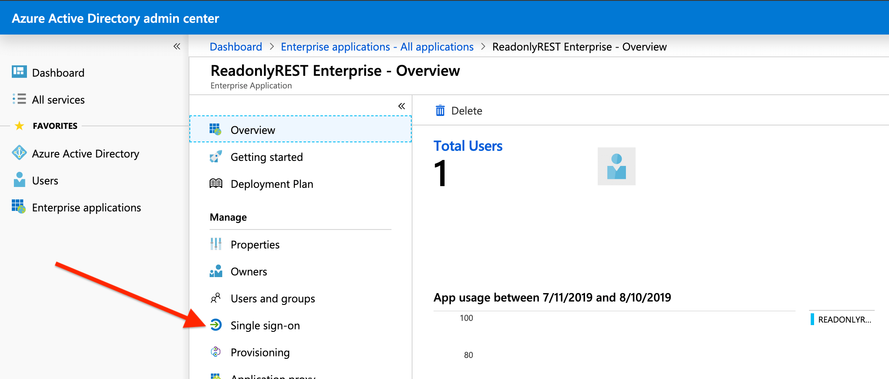
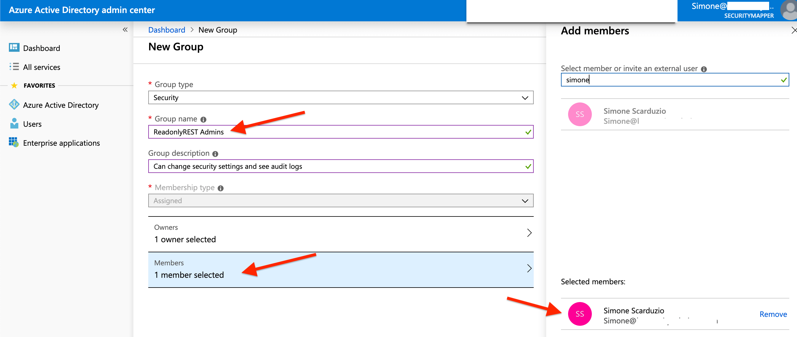

# Microsoft Azure AD

[Azure Active Directory \(Azure AD\)](https://docs.microsoft.com/en-us/azure/active-directory/fundamentals/active-directory-whatis) is Microsoft’s cloud-based identity and access management \([IAM](https://en.wikipedia.org/wiki/Identity_management)\) service. And it can be used as a SAML Single Sign-On \(SSO\) \[identity provider \(IdP\)\]\([https://en.wikipedia.org/wiki/Identity\_provider\_\(SAML](https://en.wikipedia.org/wiki/Identity_provider_%28SAML)\)\) for a pool of exiting users to sign in and access resources in external service providers like [ReadonlyREST Enterprise](https://readonlyrest.com/enterprise/).

With Azure AD, you can graphically manage users, groups, credentials and permissions. ReadonlyREST Enterprise for Kibana will collaborate with Azure AD to authenticate, grant permissions and access to tenancies for users that are entirely managed within Azure AD.

In this guide, we are going to see how to configure Elasticsearch and Kibana with ReadonlyREST Enterprise to make use of Azure AD via the SAML protocol. The result will be a multi-user, optionally multi-tenant Kibana instance powered by [ReadonlyREST](https://readonlyrest.com).

## Install Elasticsearch and Kibana

Make sure you have a functioning installation of Kibana, backed by an instance of Elasticsearch. You can find [the installation guide](https://www.elastic.co/guide/en/kibana/current/install.html) in Elastic's website.

## Set up the ReadonlyREST plugins

In order to use ReadonlyREST Enterprise for Kibana, make sure you have installed ReadonlyREST Free for Elasticsearch first. Head to our [setup guide](https://github.com/beshu-tech/readonlyrest-docs/blob/master/elasticsearch.md#installing-the-plugin) to find instructions.

Once ReadonlyREST Free plugin is installed, configure an ACL for accepting SAML sessions from ReadonlyREST Enterprise for Kibana. This is also [explained in our guide](https://github.com/beshu-tech/readonlyrest-docs/blob/master/elasticsearch.md#ror_kbn_auth). Remember to choose a very long secret phrase \(256+ characters\)

Now head to the Kibana directory, and install a trial \(or full\) version of ReadonlyREST Enterprise, which can be freely downloaded from [our download page](https://readonlyrest.com/download). For [installation instructions](https://github.com/beshu-tech/readonlyrest-docs/blob/master/kibana.md#installation), see our Kibana plugin guide.

Azure AD only speaks with "https" websites, so make sure your Kibana web server is configured to serve pages in https. See a guide from Elastic on how to enable SSL

### Conventions and assumptions in this guide

This tutorial assumes that Kibana runs in [https://localhost:5601](https://localhost:5601), which is clearly only valid if you are trying this authentication system in your local computer.

And it also assumes you used something like [mkcert](https://blog.filippo.io/mkcert-valid-https-certificates-for-localhost/) to let your browser trust SSL certificates for localhost URLs.

In the real world, when you are configuring Kibana in production, make sure: 1. You have a valid SSL certificate for the Kibana server 2. You replace all the references to `localhost:5601` with the publicly reachable host name of your actual Kibana server.

## ReadonlyREST Configuration

Now, **on the Elasticsearch side**, you should have the `$ES_HOME/config/readonlyrest.yml` file configured to accept SAML sessions from kibana using the `ror_kbn_auth` rule. I.e.

```text
readonlyrest:
    access_control_rules:

    - name: "::KIBANA-SRV::"
      auth_key: kibana:kibana

    ... all usual blocks of rules...

    - name: "ReadonlyREST Enterprise sessions"
      ror_kbn_auth:
        name: "kbn1"

    ror_kbn:
    - name: kbn1
      signature_key: "my_shared_secret_kibana1_(min 256 chars)" # <- use environmental variables for better security!
```

**On the Kibana side**, we will now configure our Kibana plugin to speak with Azure AD. Open your `$KBN_HOME/config/kibana.yml`, it should look something like:

```text
xpack.security.enabled: false

elasticsearch.hosts: ["http://localhost:9200"] # <-- consider enabling "https" using the SSL feature in ReadonlyREST Free!
elasticsearch.username: "kibana"
elasticsearch.password: "kibana"
# elasticsearch.ssl.verificationMode: none  # <-- uncomment if your Elasticsearch uses "https" with self signed certificates

server.ssl.enabled: true # <-- It's mandatory for Azure AD that we enable SSL in our Kibana server!
server.ssl.certificate: '/etc/kibana/ssl_cert/localhost.pem'
server.ssl.key: '/etc/kibana/ssl_cert/localhost-key.pem'

readonlyrest_kbn:

  logLevel: debug
  clearSessionOnEvents: ["login"]

  auth:
    signature_key: "my_shared_secret_kibana1_(min 256 chars)" # <- use environmental variables for better security!

    saml_azure:
      buttonName: 'Azure AD SAML SSO'
      enabled: true
      type: saml
      issuer: 'ror'
      protocol: 'https'
      cert: '/etc/kibana/config/cert.pem' # <-- will download later from Azure enterprise app dashboard
      entryPoint: 'https://login.microsoftonline.com/xxxxxxxx-xxxx-xxxx-xxxx-xxxxxxxxxxxx/saml2'
      kibanaExternalHost: 'localhost:5601'
      usernameParameter: 'http://schemas.microsoft.com/identity/claims/displayname'
      groupsParameter: 'http://schemas.microsoft.com/ws/2008/06/identity/claims/groups'
```

### Notes about ReadonlyREST Kibana settings

The `issuer` parameter is important and should be ideantical to what you wrote in the field _\(1\) Basic SAML Configuration - Identifier \(Entity ID\)_ in the Azure AD settings.

The `entryPoint` value should be copied from the field `(4) Set up ReadonlyREST Enterprise > Login URL` in Azure AD settings.

The `kibanaExternalHost` only accepts the browser facing hostname \(or IP address\) and optionally the port of our Kibana server. Do not put any "https://" prefix here.

The `cert` is an **absolute** path to the **base64** version of the certificate ReadonlyREST Enterprise will use to verify the signature of the SAML assertion coming from Azure AD. This file can be downloaded from : `(3) SAML Signing Certificate > Certificate (Base64)`

The `groupsParameter` and `usernameParameter` values represent the JSON fields names from the SAML assertion object coming from Azure AD. They represent the field names we take the username and groups information from.

An example of SAML assertion object coming from Azure AD after successful authentication looks like so:

```javascript
{
  "http://schemas.microsoft.com/claims/authnmethodsreferences": "urn:oasis:names:tc:SAML:2.0:ac:classes:PasswordProtectedTransport",
  "http://schemas.microsoft.com/identity/claims/displayname": "Simone Scarduzio",
  "http://schemas.microsoft.com/identity/claims/identityprovider": "https://sts.windows.net/88af1572-1347-45b6-8f65-xxxxxxxxx/",
  "http://schemas.microsoft.com/identity/claims/objectidentifier": "486abf50-a61f-40e9-8a37-3ff6a6eeda26",
  "http://schemas.microsoft.com/identity/claims/tenantid": "88af1572-1347-45b6-8f65-xxxxxxxxxxxx",
  "http://schemas.microsoft.com/ws/2008/06/identity/claims/groups": [
    "00f22de3-0d59-4867-8e1a-xxxxxxxxxxxx",
    "dbe4ff5a-deba-419f-a653-xxxxxxxxxxxx",
    "3c19b288-263c-4dd1-9947-xxxxxxxxxxxx"
  ],
  "http://schemas.microsoft.com/ws/2008/06/identity/claims/wids": "62e90394-69f5-4237-9190-xxxxxxxxxxxx",
  "http://schemas.xmlsoap.org/ws/2005/05/identity/claims/givenname": "Simone",
  "http://schemas.xmlsoap.org/ws/2005/05/identity/claims/name": "Simone@ror-enterprise-test.com",
  "http://schemas.xmlsoap.org/ws/2005/05/identity/claims/surname": "Scarduzio",
  "issuer": "https://sts.windows.net/88af1572-1347-45b6-8f65-xxxxxxxxxxxx/",
  "nameID": "Simone@ror-enterprise-test.com",
  "nameIDFormat": "urn:oasis:names:tc:SAML:1.1:nameid-format:emailAddress",
  "sessionIndex": "_97f290ee-2ff6-445f-a0c6-xxxxxxxxxxxx",
  "user": "Simone Scarduzio"
}
```

## Azure AD configuration

1. Login in your Microsoft Azure dashboard, and head to Enterprise Applications.


1. Click on "Non-gallery application".


1. Create a new app called "Readonlyrest Enterprise".


1. Click "Single Sign On" to configure the app for SAML.



1. Insert URLs and data about our Kibana server as shown in the picture. And press SAVE.


1. Download the base64 encoded "pem" file, and place it under the **absolute path** `/etc/kibana/config/cert.pem`.


7 Make sure this app has at least a test user assigned, and press SAVE. Otherwise the single sign-on will fail.


## Testing if this all works.

1. Now point your browser to your Kibana installation \(in the example [https://localhost:5601](https://localhost:5601)\).

   You should now see a new blue button that says "Azure AD SAML SSO".


1. Press it, and you should see the Azure AD login page. Place your credentials here, or pick an already authenticated identity to enter Kibana.


1. You will now be redirected to Kibana, logged in as your Azure AD identity.


1. You can now logout from the "ReadonlyREST SAML SSO" Azure AD Enterprise app by pressing the exit button right beside the username in the bottom right corner.


## Authorization using Azure AD groups

Users in Azure AD can belong to groups. The list of group associated to a user is useful information for ReadonlyREST Enterprise for identifying sets of users that we want to authorize to:

* see certain indices
* perform certain actions over certain indices
* belong to a tenancy
* have read or read/write permission to a tenancy
* have administrative rights over ReadonlyREST cluster-wide security settings
* many more things, or even a combination of all these.

### Example: ReadonlyREST Admins group

Suppose we would like to authorise the group "ReadonlyREST Admins" to access the administrative dashboard that can oversee all the indices, and we want to grant them access to an "admin" tenancy that contains dashboards based on the real time [ReadonlyREST audit logs](https://github.com/beshu-tech/readonlyrest-docs/blob/master/elasticsearch.md#audit-logs) indices.

#### Creating and assigning the group in Azure Ad

Let's go to Azure and make sure the "ReadonlyREST Admins" group is created, and one or more users - including ours - belongs to it.



#### Finding the new group's Azure object ID

From ReadonlyREST settings, we will refer to the newly created group using its associated object ID provided by Azure platform. To discover it, navigate the Azure AD dashboard to:

`Dashboard > Enterprise applications - All applications > ReadonlyREST Enterprise - Users and groups > [your user] - Groups`


The object ID of the new group is "3f8ebed8-f742-42a6-94ba-2d57550fc3cf", let's take note of this. We will use it in our ACL.

#### Using ReadonlyREST ACL to authorize the group

Let's head back to Elasticsearch, and open `readonlyrest.yml`. Let's now add the authorization.

```text
readonlyrest:
    access_control_rules:

    - name: "::KIBANA-SRV::"
      auth_key: kibana:kibana


    - name: "Azure AD - ReadonlyREST Admins group"
      kibana_index: ".kibana_admin_tenancy"
      indices: [".kibana_admin_tenancy", "readonlyrest-audit*"]
      kibana_access: "admin"
      ror_kbn_auth:
        roles: ["3f8ebed8-f742-42a6-94ba-2d57550fc3cf"]
        name: "kbn1"


    - name: "Azure AD - Anyone else"
      indices: [".kibana_generic_tenancy", "readonlyrest-audit*"]
      kibana_index: ".kibana_generic_tenancy"
      kibana_access: "rw"
      kibana_hide_apps: ["readonlyrest_kbn"]
      ror_kbn_auth:
        name: "kbn1"

    ror_kbn:
    - name: kbn1
      signature_key: "my_shared_secret_kibana1_(min 256 chars)" # <- use environmental variables for better security!
```

Now we have two ACL blocks dedicated to Azure AD: one will match for users that belong to "ReadonlyREST Admins" \(a.k.a object ID `3f8ebed8-f742-42a6-94ba-2d57550fc3cf`\), the other will match for Azure AD users that do not belong to the group.

The key here is the use of the `roles` option in the `ror_kbn_auth` rule, as an extra constraint so that the ACL block is only matched when the user has the "3f8ebed8-f742-42a6-94ba-2d57550fc3cf" string in the list of their groups.

