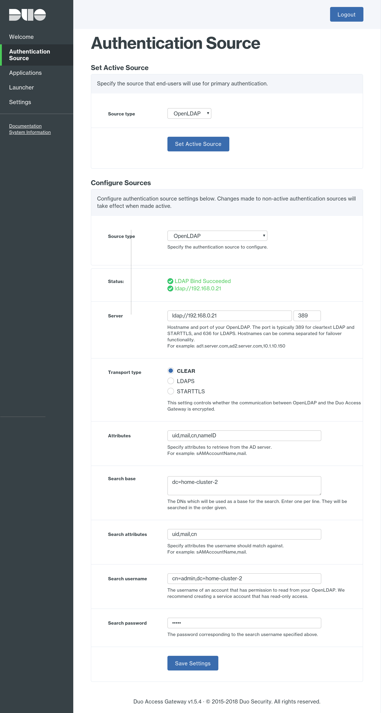
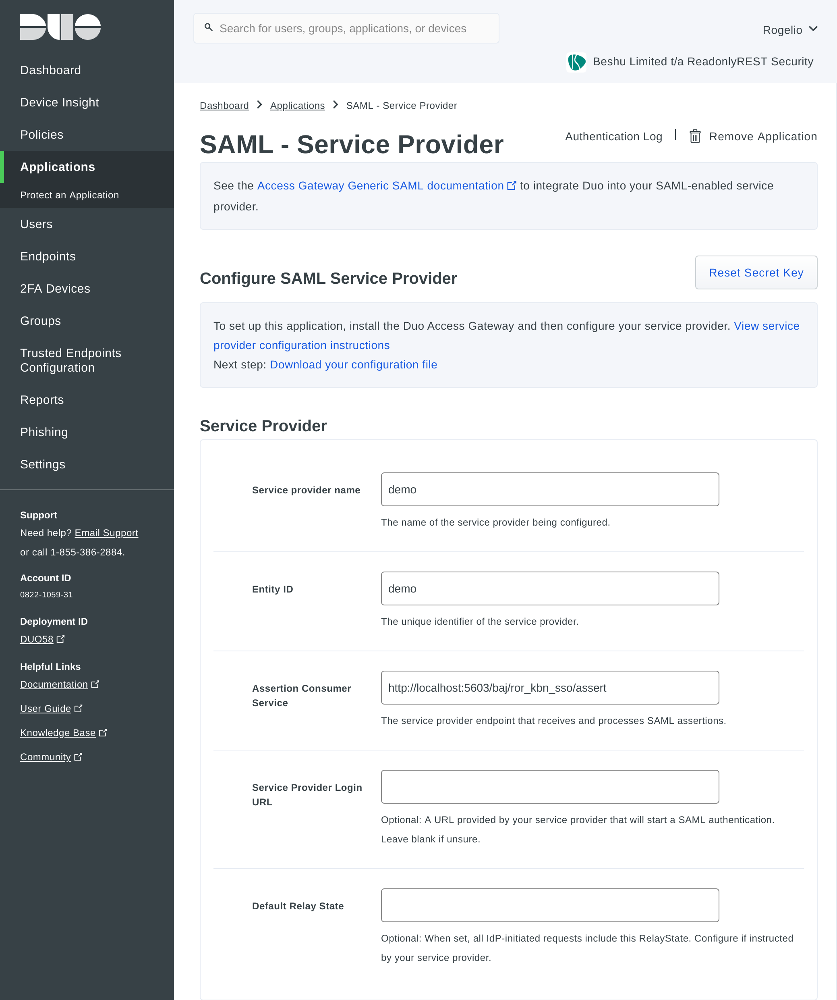

## Integrating ReadonlyREST Enterprise via SAML with Duo Security (MFA)

This tutorial is a step by step guide for the integration between [DUO](https://duo.com) multi factor authentication provider and [ReadonlyREST Enterprise](https://readonlyrest.com/enterprise). 

The multi factor authentication (MFA) provided by DUO is an additional authorization step for the user after they have inserted the correct credentials. This extra step is mediated by the DUO platform and it is either an SMS, a push notification to their app, or a one time password obtained via their app or google authenticator.

For this tutorial you are going to need:

* A valid installation of ReadonlyREST Enterprise (trial, or official) Kibana plugin. If you haven't got one, [get your own trial build here](https://readonlyrest.com/enterprise).

* A valid trial or paid account in DUO website (see [pricing](https://duo.com/pricing), you are going to need the "Remote Access & Single Sign-On (SSO)" feature.

### Duo Access Gateway (DAG) server configuration
The access gateway is a piece of software released by DUO that takes care of integrating on premises service providers like ReadonlyREST SAML with arbitrary identity providers (like LDAP) and the multi factor authentication features offered by DUO platform.

#### Installing Duo Gateway
Follow the instructions for Duo Gateway (https://duo.com/docs/dag-linux). The gateway is a Docker container and it will need the ports 80 and 443 to be available, so you will probably need a dedicated VM or Bare Metal so that Duo Gateway can properly bind to these ports.

#### Configuring Authentication Source
Once the Duo Gateway is installed, open a browser and point to its web interface to configure it. 
When you configure the authentication sources, be sure to set the correct username attribute. Keep in mind this value because it will be mapped directly to whatever has been configured in the actual Duo.com dashboard, under `Gateway > Applications` (which we are just about to configure).



#### Configure Application in Duo Admin Dashboard
In the Duo Administration dashboard, go to Applications. Click  `Protect an Application`, then search for `Generic` and click `Protect this Application` button.

This will create a generic SAML provider. Set these fields:
- Service provider name: A name that refers to your ReadonlyREST Enterprise  installation
- EntityID: Set an existing entity name or use the same as Service Provider Name
- Assertion Consumer Service: The SAML Url assertion found in metadata.xml, the url format is `<kibanaExternalHost>/ror_kbn_sso/assert`. 



In SAML Response, set NameID to be the same variable name as configured previously in the authentication source. Leave the default values for the remaining settings. Click `Save Application` and scroll up and download the configuration file.


### ReadonlyRest Configuration
To  configure SAML, both Kibana and Elasticsearch ROR configuration needs to be edited to enable SAML in Duo Gateway.

#### Configuring the Elasticsearch plugin

Open your `readonlyrest.yml` file or login as a local administrator in your ReadonlyREST Enterprise, and add this extra configuration required for SAML authentication.

```yml
readonlyrest:
  access_control_rules:

#    [... all your regular ACL blocks ...]

    - name: "ReadonlyREST Enterprise Kibana instance #1"
      ror_kbn_auth:
        name: "kbn1"

# OPTIONAL FOR SECONDARY KIBANA ###
#
#    - name: "ReadonlyREST Enterprise Kibana instance #2"
#      ror_kbn_auth:
#        name: "kbn2"

  ror_kbn:
    - name: kbn1
      signature_key: "shared_secret_kibana1_(256+chars)" # <- use environmental variables for better security!

# OPTIONAL FOR SECONDARY KIBANA ###
#    - name: kbn2
#      signature_key: "shared_secret_kibana2(256+chars)" # <- use environmental variables for better security!
```

This authentication and authorization connector represents the secure channel (based on JWT tokens) of signed messages necessary for our Enterprise Kibana plugin to securely pass back to ES the username and groups information coming SAML identity provider. 


#### Configuring the Kibana plugin
Edit $KIBANA_HOME/conf/kibana.yml configuration and append:

```yml
readonlyrest_kbn.auth:
  signature_key: “a very long key (more than 256 characters) goes here …..” # the same signing key added above in ES config
  saml:
    enabled: true
    entryPoint: 'https://duo-gateway.xyz/dag/saml2/idp/SSOService.php?spentityid=demo'
    kibanaExternalHost: 'ror-deployment.xyz' # <-- public URL used by the Identity Provider to call back Kibana with the "assertion" message
    usernameParameter: 'nameID'
    groupsParameter: 'memberOf'
    logoutUrl: 'https://duo-gateway.xyz/dag/saml2/idp/SingleLogoutService.php?ReturnTo=https://duo-gateway.xyz/dag/module.php/duosecurity/logout.php'
    decryptionCert: certs/dag.crt
    cert: certs/dag.crt
```

The following fields are mapped to the Duo Gateway Application Metadata:

- entryPoint: LoginUrl for the SAML Generic Application
- usernameParameter: Default SAML Generic Application value is `nameID`
- logoutUrl: a URL that points to the value found in the screen `Metadata > Logout URL`
- decryptionCert: The downloadable certificate in Metadata (absolute path)
- cert: The downloadable certificate in Metadata (absolute path)
- signature_key: Signing key string for JWT, must match the same key value in elasticsearch ROR config
- kibanaExternalHost: The Kibana (with ReadonlyREST Enterprise) instance public hostname
- protocol: protocol schema (http or https) of the external Kibana host
- issuer: distinctive name of the identity provider (optional)
- decryptionPvk: service provider private key (string value) (optional)

For more advanced configurations and information, please refer to [passport-saml documentation](https://github.com/bergie/passport-saml)

#### Elasticsearch index in Kibana ROR Dashboard
Make sure to update signature_key in ROR Dashboard with the value. Otherwise you will get JWT errors while login with SAML.


### Login with SAML 2FA enabled
Go to ReadonlyREST Login page (http://ror-deployment.xyz/login) and click the SAML SSO button. This will redirect to Duo Security Gateway and ask for a two factor code to proceed. Note that the first time it will provision a two factor seed mapped to the user account.

Once Duo authenticates, it will redirect you to the private Kibana session powered by ReadonlyREST Enterprise.

### Logout from SAML from ReadonlyREST Enterprise logout button
Click the Logout button from ROR Dashboard. This will redirect you to Duo Gateway logout completion page. Follow the instructions and close the window.
    
